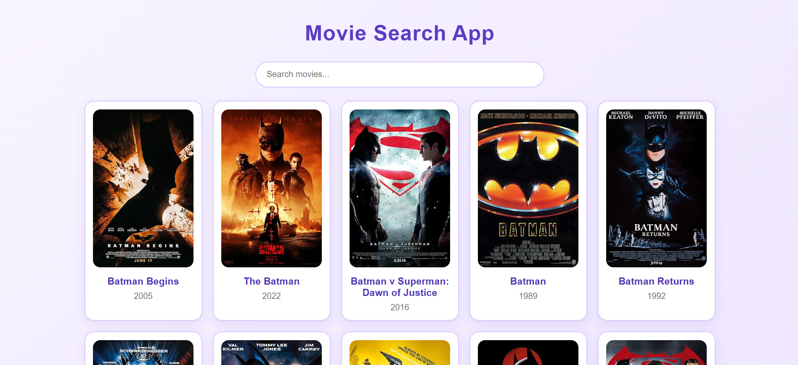
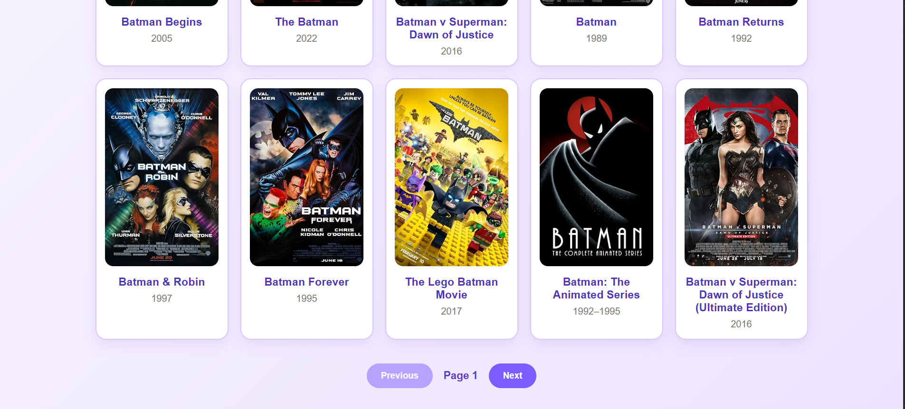
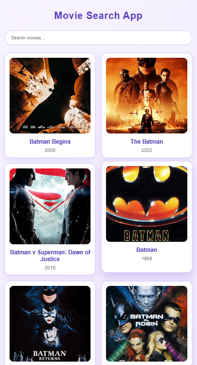
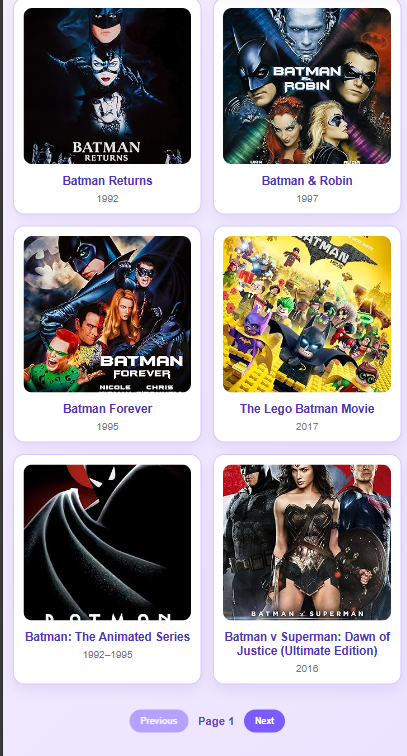
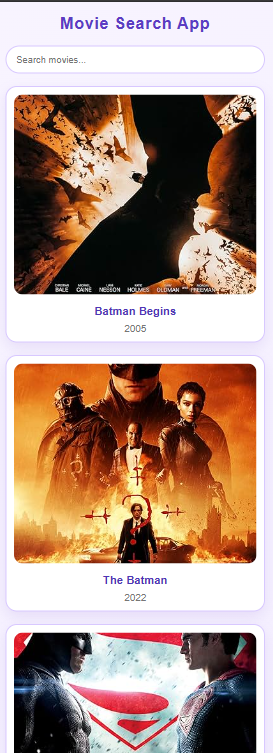

# Movie Search App

Bu layihə React və Vite istifadə edilərək hazırlanmış film axtarış tətbiqidir. Tətbiq OMDb API vasitəsilə filmləri axtarmağa, nəticələri səhifələməyə və istifadəçiyə rahat interfeys təqdim etməyə imkan verir.

## İstifadə olunan texnologiyalar

- React
- Vite
- JavaScript (ES6+)
- CSS3
- OMDb API

## Funksiyalar

- Film adına görə axtarış
- Debounce (500 ms)
- Loading (yüklənmə) vəziyyəti
- Error (xəta) mesajları
- Empty state (nəticə olmadıqda mesaj)
- Pagination (səhifələmə)
- AbortController ilə köhnə sorğuların ləğvi
- Custom Hook (`useFetch`)
- Responsive dizayn

## Layihə strukturu

src
│
├── components
│   ├── Card.jsx
│   ├── ResultsList.jsx
│   └── SearchBar.jsx
│
├── hooks
│   └── useFetch.jsx
│
├── pages
│   └── Home.jsx
│
├── services
│   └── api.js
│
├── App.jsx
└── main.jsx

## Ekran görüntüləri


### Ana səhifə




### Tablet görünüşü



 
### Mobil görünüşü



## Quraşdırma

Repository-ni klonlayın:

```bash
git clone https://github.com/hesenovasonaa/Movie-search-app.git
```

Layihə qovluğuna daxil olun:

```bash
cd Movie-search-app
```

Asılılıqları quraşdırın:

```bash
npm install
```

`.env` faylı yaradın və API açarınızı əlavə edin:

```env
VITE_OMDB_API_KEY=Sizin_API_Açarınız
```

Layihəni başladın:

```bash
npm run dev
```

## API

Bu layihədə **OMDb API** istifadə olunmuşdur.

https://www.omdbapi.com/
